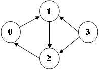

# 6-1 Strongly Connected Components
Write a program to find the strongly connected components in a digraph.
## Format of functions:
```c
void StronglyConnectedComponents( Graph G, void (*visit)(Vertex V) );
```
where `Graph` is defined as the following:
```c
typedef struct VNode *PtrToVNode;
struct VNode {
    Vertex Vert;
    PtrToVNode Next;
};
typedef struct GNode *Graph;
struct GNode {
    int NumOfVertices;
    int NumOfEdges;
    PtrToVNode *Array;
};
```
Here `void (*visit)(Vertex V)` is a function parameter that is passed into `StronglyConnectedComponents` to handle (print with a certain format) each vertex that is visited. The function `StronglyConnectedComponents` is supposed to print a return after each component is found.
## Sample program of judge:
```c
#include <stdio.h>
#include <stdlib.h>

#define MaxVertices 10  /* maximum number of vertices */
typedef int Vertex;     /* vertices are numbered from 0 to MaxVertices-1 */
typedef struct VNode *PtrToVNode;
struct VNode {
    Vertex Vert;
    PtrToVNode Next;
};
typedef struct GNode *Graph;
struct GNode {
    int NumOfVertices;
    int NumOfEdges;
    PtrToVNode *Array;
};

Graph ReadG(); /* details omitted */

void PrintV( Vertex V )
{
   printf("%d ", V);
}

void StronglyConnectedComponents( Graph G, void (*visit)(Vertex V) );

int main()
{
    Graph G = ReadG();
    StronglyConnectedComponents( G, PrintV );
    return 0;
}
/* Your function will be put here */
```
## Sample Input (for the graph shown in the figure):

```
4 5
0 1
1 2
2 0
3 1
3 2

```
## Sample Output:
```
3 
1 2 0 

```
Note: The output order does not matter. That is, a solution like
```
0 1 2 
3
```
is also considered correct.
