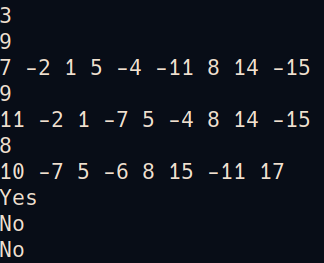

# FDS Project 2 - Normal Is It A Red-Black Tree
## Chapter 1: Introduction
There is a kind of balanced binary search tree named red-black tree in the data structure. It has the following 5 properties:

(1) Every node is either red or black.

(2) The root is black.

(3) Every leaf (NULL) is black.

(4) If a node is red, then both its children are black.

(5) For each node, all simple paths from the node to descendant leaves contain the same number of black nodes.

For example, the tree in Figure 1 is a red-black tree, while the ones in Figure 2 and 3 are not.

| Figure 1 | Figure 2 | Figure 2 |
| :---: | :---: | :---: |
|  |  |  |

For each given binary search tree, you are supposed to tell if it is a legal red-black tree.
## Chapter 2: Algorithm Specification
To achieve main goals of the project, below 2 algorithms need to be implemented :
- building the red-black tree by giving preorder sequence
```c
// # Function tree_build_help
// # Intro: recursivily build node, and build the relationship between nodes
//  - int* nums: preorder sequence
//  - int low: current smallest index in preorder
//  - int high: current largest index in preorder
//  - returns: current build node
TreeNode* tree_build_help(int* nums, int low, int high){
  if(high < low) return node_nil();
  TreeNode* node = node_init(nums[low]);
  int root_num = node->value;
  // <key point> : if idx dosent match any number, it will be high+1
  int idx;
  for(idx=low+1; idx<=high; idx++){
    int cur_num = nums[idx];
    if(cur_num<0) cur_num = -1*cur_num;
    if(cur_num > root_num) break;
  }
  node->child[0] = tree_build_help(nums, low+1, idx-1);
  node->child[1] = tree_build_help(nums, idx, high);
  return node;
}

// # Function tree_build_by_preorder
// # Intro: create a tree by giving preorder sequence
//  - int* nums: preorder sequence
//  - int size: sequence size
//  - returns: red-black-tree
BlackRedTree* tree_build_by_preorder(int* nums, int size){
  BlackRedTree* res = tree_init();
  res->root = tree_build_help(nums, 0, size-1);
  return res;
}
```
- check the current red-black tree is legal
```c
// # Function tree_is_black_red_help
// # Intro: judge legality by recursivily(DFS way) scanning all node 
//  - TreeNode* node: current tree node
//  - TreeNode* parent: current node's parent (Root node's parent is NULL)
//  - int black_count: count how many black nodes we meet
//  - returns: 0=>not legal, 1=>legal
int tree_is_black_red_help(TreeNode* node, TreeNode* parent, int black_count){
  if(node==NULL) return 1;
  if(parent==NULL){
    // current node is root node
    if(node->color == RED) return 0;
    return 1*
        tree_is_black_red_help(node->child[0], node, 1)*
        tree_is_black_red_help(node->child[1], node, 1);
  }
  else if(node_is_nil(node)){
    // current node is nil node
    black_count++;
    if(nil_length==0){
      // first meet nil node
      nil_length = black_count;
      return 1;
    }
    if(black_count!=nil_length) return 0;
    return 1;
  }
  else{
    // current node is normal node
    if(parent->color==RED && node->color==RED) return 0;
    if(node->color == BLACK) black_count++;
    return 1*
        tree_is_black_red_help(node->child[0], node, black_count)*
        tree_is_black_red_help(node->child[1], node, black_count);
  }
}

// # Function tree_is_black_red
// # Intro: judge the tree's legality
//  - BlackRedTree* tree: red-black-tree
//  - returns: 0=>not legal, 1=>legal
int tree_is_black_red(BlackRedTree* tree){
  if(tree==NULL || tree->root==NULL) return 0;
  nil_length = 0;
  return tree_is_black_red_help(tree->root, NULL, 0);
}
```
## Chapter 3: Testing Results
- Testing codes on PTA


- Sample output


## Chapter 4: Analysis and Comments
- For building tree:

Base the fact of the algorithm meeting every node [N] in recursive way, and do searching in current preorder sequence , the worst time complexity of building tree is O(N*N)
- For checking tree:

Base the fact of the algorithm checking every node [N] in recursive way, the time complexity of checking one tree is O(N)
